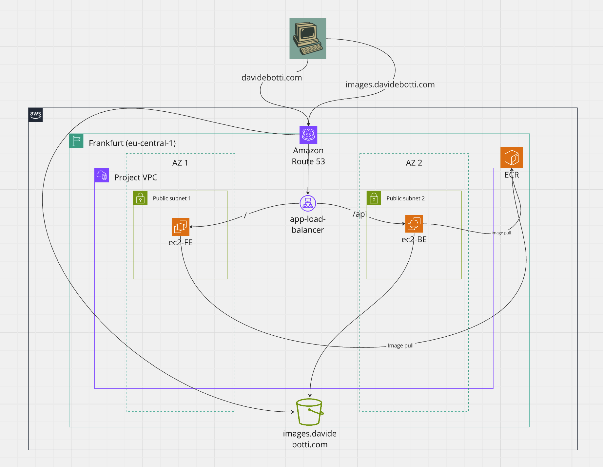

# AWS EXAMPLE

As a product engineers we are always focus on building new features using programming languages and
other frameworks, sometimes forgetting about the whole picture, in which cloud and product technologies
are equally important.
This project is a personal POC that aims to be a comprehensive guide for the deployment
of a digital product, focusing on the most neglected part by us (product engineers), the platform.

## Detailed Description

This is a terraform POC that provisions different resources in a AWS cluster to produce
a working digital product (an image uploader at the moment).

It provisions a VPC with 2 public subnets and 2 private subnets, an ec2 micro instance 
(free tier eligible) with a proper security group, an internet gateway for the VPC.
The ec2 instance has a specific role assigned, that can be used 
to pull a docker image from the private ECR.
It has a s3 bucket too, used to store the images uploaded by the users and an ALB used 
to route requests to the FE or the BE service.

On the instances are deployed the following applications: 
[https://github.com/dade92/aws-upload-ui]  for the FE part and 
[https://github.com/dade92/spring-example2]  for the BE part.

It also provisions a route 53 record attached to a public domain, davidebotti.com.

Here the architecture:

